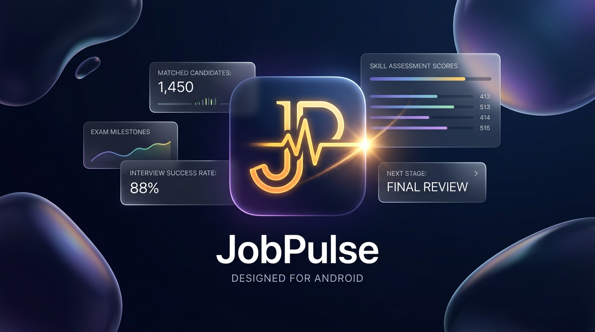
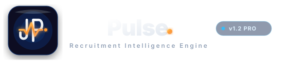
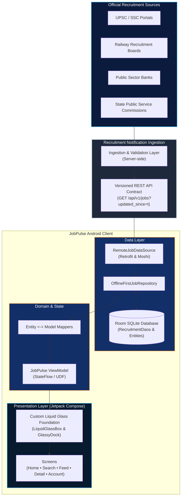

<div align="center">

<picture>
  <source media="(prefers-color-scheme: dark)" srcset="docs/assets/jobpulse_hero_banner.jpg">
  
</picture>

<br/>



<br/>
<br/>

**The Recruitment Intelligence Engine for Android.**  
*Fluid. Offline-first. Engineered for absolute clarity.*

<br/>

[-0A84FF?style=for-the-badge&logo=android&logoColor=white)](https://developer.android.com)
[](https://kotlinlang.org)
[](https://developer.android.com/jetpack/compose)
[](https://developer.android.com/design)
[-FF9F0A?style=for-the-badge&logo=sqlite&logoColor=white)](https://developer.android.com/training/data-storage/room)
[](https://github.com/AnimeXplayXD/JoB_Pulse/actions)
[](#license)

<br/>

[Overview](#overview) •
[Why JobPulse](#why-jobpulse) •
[Key Features](#key-features) •
[Architecture](#architecture-overview) •
[Data Integrity](#data-integrity--source-model) •
[Tech Stack](#technology-stack) •
[Quick Start](#quick-start) •
[Wiki](#wiki--extended-documentation)

---

</div>

<br/>

## Overview

In public recruitment, opportunity is frequently obscured by fragmented notifications, complex eligibility rules, conflicting schedules, and scattered cutoffs across hundreds of public agencies, civil service commissions, railway recruitment boards, defense forces, and nationalized banks.

**JobPulse** provides a modern native Android experience that transforms chaotic recruitment streams into structured, actionable intelligence. Engineered with an offline-first architecture, spatial information hierarchy, refined motion, and a custom Liquid Glass-inspired material foundation, JobPulse empowers candidates with absolute clarity and zero distractions.

---

## Why JobPulse

- **Zero Client Scraping**: JobPulse does not scrape third-party websites or HTML DOMs on client devices, preserving battery life and data.
- **No Fabricated Information**: When official bodies have not announced dates or admit cards, JobPulse shows strict semantic states (`Not announced`, `Not available`, `Not applicable`) rather than guessing.
- **Offline-First Resilience**: An embedded Room SQLite database acts as the single source of truth so saved vacancies, syllabi, and quotas are accessible anywhere.
- **Organization-Adaptive Identity**: Recruits dynamically adopt the authentic color signatures and visual branding of the hiring agency (SBI, Railways, UPSC, SSC, Defense, State Police).

---

## Key Features

- **Custom Liquid Glass Material System**: Built in Jetpack Compose (`LiquidGlassBox`) using calibrated frosted translucency (`tokens.glassTint`), top-rim specular highlights, dual-stop borders, and elevation depth shadows. Because Android Compose operates directly on RenderNodes without background sampling, this approach provides a tactile glass aesthetic while keeping foreground content pin-sharp and maintaining smooth frame rates.
- **Floating Touch-Drag Dock (`GlassyDock`)**: A translucent navigation capsule featuring interactive touch tracking, spring interpolation, and intelligent auto-hide during velocity scrolling.
- **Spatial Motion & Container Transforms**: Double-tap card interactions seamlessly morph into full-screen dossiers via Compose `SharedTransitionLayout`, complemented by single-tap inline accordion previews.
- **Contextual Notification Intelligence**: High-priority alert channels (`jobpulse_alerts`) and milestone channels (`jobpulse_milestones`), compliant with Android 13+ runtime permissions.

---

## Architecture Overview

JobPulse follows a decoupled, unidirectional data flow (UDF) with MVVM architecture:



---

## Data Integrity & Source Model

### The "No Fabricated Data" Principle
> **"If the authoritative source does not provide a value, JobPulse does not invent one."**

When statutory recruitment bodies have not announced specific milestones or links, JobPulse uses explicit semantic states:
- `Not announced`: Confirmed by official notification to be released at a later date.
- `Not available`: Authority has not published data for this category or post.
- `Not applicable`: Requirement or stage does not apply to this vacancy.

### Source Classification
- **Official Source**: Published notification directly from a statutory portal or official notification PDF.
- **Secondary Source**: Informational reference from public news or portal announcements; flagged accordingly.
- **Unverified**: Ingestion record pending confirmation against official releases.
- **Development Data**: Seeded local mock records used for previews and testing.

*Note: JobPulse is designed to ingest structured recruitment information through a dedicated server-side ingestion layer. Production server-side ingestion is under active development; the client currently pairs its offline-first repository with local cache and development data providers. Client-side database synchronization does not constitute legal or statutory verification.*

---

## Technology Stack

| Domain | Library / Specification | Version | Architectural Role |
|---|---|---|---|
| **Language** | Kotlin | `2.2.10` | Modern, type-safe development |
| **UI Toolkit** | Jetpack Compose | BOM `2024.09.00` | Declarative UI framework with Material 3 |
| **Material Foundation** | Custom Liquid Glass | Native Compose | Frosted translucency, specular rims & spring dock |
| **Local Persistence** | Room Database | `2.7.0` (KSP) | SQLite abstraction layer with reactive Flow queries |
| **Networking** | Retrofit + OkHttp | `2.12.0` / `4.10.0` | REST client with HTTPS transport & logging interceptor |
| **Serialization** | Moshi Kotlin | `1.15.2` (KSP) | Reflection-free JSON parsing and code generation |
| **Build Tooling** | Gradle / AGP | `9.3.1` / `9.1.1` | Kotlin DSL build engine with Java 17 toolchain |
| **Target Platform** | Android | `minSdk 24` • `targetSdk 36` | Supported from Android 7.0 to Android 16 |
| **Testing** | JUnit / Robolectric / Roborazzi | `4.13.2` / `4.16.1` / `1.59.0` | Unit, framework shadow, and screenshot test suite |

---

## Current Status & Brand Assets

- **Development Status**: Native Android client, offline Room caching, custom design system, and automated test suite are functional and verified passing in CI. Production server-side ingestion is in progress.
- **Brand Assets**:
  - **JobPulse Wordmark**: Vector logotype (`docs/assets/jobpulse_logo.svg`).
  - **JP Pulse Monogram**: Core waveform glyph representing continuous recruitment telemetry.
  - **Adaptive Launcher Icon**: Multi-density foreground and background layers (`app/src/main/res/mipmap-*/`).
  - **Material You Dynamic Icon**: Monochrome vector (`ic_launcher_monochrome`) supporting Android 13+ dynamic theming.
  - **Visual Showcase Assets**: Marketing banner (`docs/assets/jobpulse_hero_banner.jpg`) and icon render (`docs/assets/jobpulse_app_icon.jpg`).

---

## Quick Start

### Prerequisites
- Java Development Kit: JDK 17+ (JDK 22 supported)
- Android Studio: Ladybug (2024.2+) or later
- Android SDK: Platform `API 36`, Build Tools `36.0.0`

### Build & Run
```bash
# 1. Clone repository
git clone https://github.com/AnimeXplayXD/JoB_Pulse.git
cd JoB_Pulse

# 2. Build debug APK
./gradlew assembleDebug

# 3. Run unit and Robolectric tests
./gradlew testDebugUnitTest
```

*Windows PowerShell users can execute `.\gradlew.bat assembleDebug` and `.\gradlew.bat testDebugUnitTest`.*

*Note on Configuration: Default settings compile out of the box using `.env.example`. Creating a `.env` file is optional for local development API credentials.*

### Deploy to Connected Target
```bash
# Install to connected device or emulator
adb install app/build/outputs/apk/debug/app-debug.apk

# Launch main activity
adb shell am start -n com.aistudio.govtjobs.pxrtwa/com.example.MainActivity
```

---

## Testing & Quality Assurance

JobPulse maintains strict automated testing across data, business logic, and UI:

```powershell
.\gradlew.bat testDebugUnitTest
```

- **`BrandIdentityTest`**: Enforces strict brand compliance (app name `"JobPulse"`, notification channel naming, vector drawable resolution, and pure-white geometry on `ic_launcher_monochrome`).
- **`LiquidGlassAndDockTest`**: Verifies dock tab state changes, navigation bounds, and custom Liquid Glass token values across Dark and Light themes.
- **`OfflineFirstJobRepositoryTest`**: Validates Room database fallback during network interruptions and cache hydration.
- **`JobMappersTest`**: Asserts bidirectional data fidelity across DTO $\leftrightarrow$ Entity $\leftrightarrow$ Domain Model conversions.

---

## Roadmap

- **Milestone 1: Client Foundation (Current)**
  - [x] Custom Liquid Glass material system with specular highlights and spring-interpolated `GlassyDock`.
  - [x] Room SQLite offline-first persistence with reactive Kotlin `StateFlow`.
  - [x] Adaptive organization visual identity (UPSC, SSC, Railways, Banking, Defense, Police).
  - [x] Android 13+ Material You monochrome icon and contextual notification channels.
  - [x] Comprehensive test suite with Robolectric and GitHub Actions CI.
- **Milestone 2: Cloud Ingestion & Edge Sync (In Progress)**
  - [ ] Production server-side recruitment notification ingestion and validation pipeline.
  - [ ] Android WorkManager periodic background synchronization with battery-conscious network constraints.
  - [ ] Cloud push notification integration for critical application deadlines.
- **Milestone 3: Future Exploration**
  - [ ] Extended coverage across regional and municipal recruitment boards.
  - [ ] Personalized candidate alert rules and eligibility matching.

---

## Disclaimer

> [!IMPORTANT]
> **Independent Service Notice**  
> JobPulse is an independent recruitment-information application and is not affiliated with, authorized by, or endorsed by any government department, recruiting authority, or organization represented in the application.  
> 
> Candidates should verify all recruitment details, eligibility criteria, dates, and application procedures against the official recruitment notification and official authority portal before applying or paying fees.

---

## License

**License: To be determined.**

---

## Wiki & Extended Documentation

Detailed technical specifications, recruitment data schemas, design tokens, and testing architecture are documented in the [JobPulse GitHub Wiki](https://github.com/AnimeXplayXD/JoB_Pulse/wiki).
