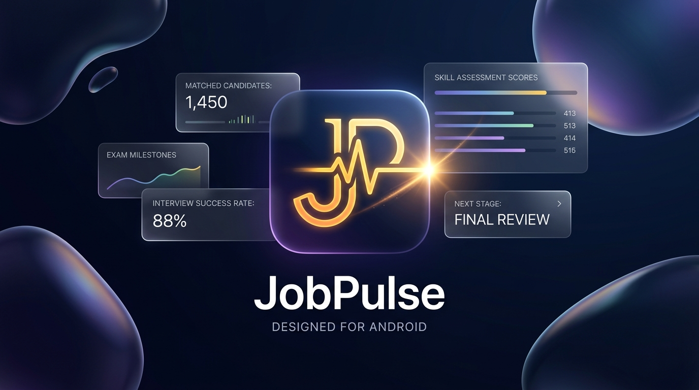
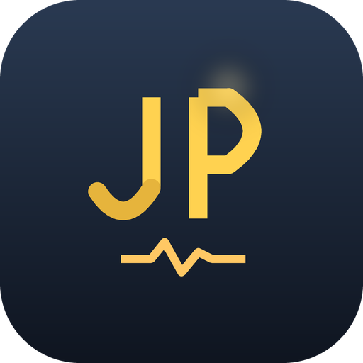
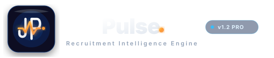
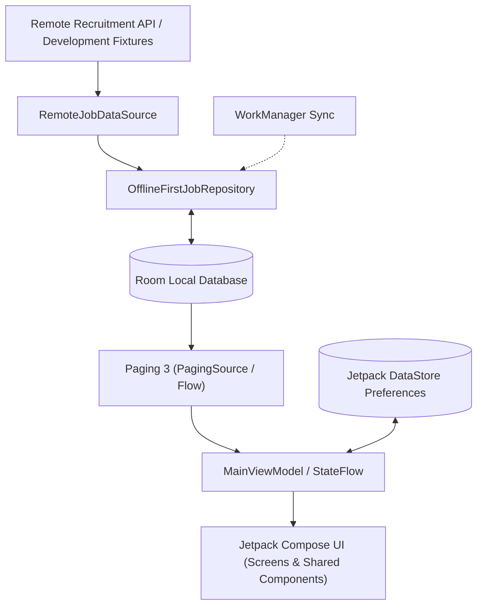

<div align="center">

<picture>
  <source media="(prefers-color-scheme: dark)" srcset="docs/assets/jobpulse_hero_banner.jpg">
  
</picture>

<br/>


<br/>


<br/>
<br/>

**Recruitment information, thoughtfully organized.**  
*A native Android experience for exploring opportunities, saving jobs, and tracking what matters.*

[](https://github.com/AnimeXplayXD/JoB_Pulse/releases/latest)
[](https://github.com/AnimeXplayXD/JoB_Pulse/releases)
[](https://github.com/AnimeXplayXD/JoB_Pulse/actions/workflows/android-build-test.yml)
[](https://developer.android.com)
[](https://kotlinlang.org)
[](https://developer.android.com/compose)

[Download APK](#-download--install) · [Overview](#overview) · [Experience](#the-experience) · [Architecture](#architecture) · [GitHub Releases & CI](#-github-releases--cicd) · [Build & Run](#build-and-run) · [Testing](#testing)

</div>

---

## 📲 Download & Install

You can download ready-to-install APKs directly from the **[GitHub Releases](https://github.com/AnimeXplayXD/JoB_Pulse/releases)** page:

1. Head over to **[Releases](../../releases/latest)**.
2. Under **Assets**, download the latest APK:
   - **`JobPulse-v*-debug.apk`**: Pre-configured debug build ready for instant side-loading without signing restrictions.
   - **`JobPulse-v*-release*.apk`**: Production-optimized and ProGuard/R8 minified APK.
3. Open the downloaded `.apk` on your Android device and allow **"Install from unknown sources"** when prompted.

---

## Overview

**JobPulse** is a modern Kotlin and Jetpack Compose Android application for discovering and tracking recruitment opportunities across public-sector organizations. It consolidates vacancy summaries, qualifications, key dates, syllabus outlines, and application portals into a clean, distraction-free interface.

Designed with an offline-first architecture, JobPulse pairs a local **Room** database with **Paging 3** and asynchronous **WorkManager** synchronization, allowing you to browse, search, and bookmark jobs even without an active internet connection.

---

## The Experience

### Two-stage expandable job cards
- **Quick Tap:** Expands inline summary details including qualifications, age requirements, fees, and category reservations.
- **Deep Dive:** Tap **View full details** to trigger a smooth shared-container transition into the complete breakdown.
- **Independent Bookmarking:** Bookmark or unbookmark anytime directly from the card header without collapsing the preview.

### Glassmorphism & Adaptive Motion
- **Floating Glass Dock:** A floating navigation dock with dynamic backdrop blur on Android 12+ (RenderEffect / GPU blur) and translucent fallbacks on earlier Android versions.
- **Radial Theme Reveal:** Interactive dark/light mode toggle with a circular reveal animation originating directly from the toggle control.
- **Smooth 60/120 FPS Browsing:** High-performance list rendering optimized with minimal layout passes, cancellation-aware search queries, and Compose item keys.

### Accessibility First (a11y)
- Fully audited screen-reader semantics with `isTraversalGroup` and `mergeDescendants` for intuitive TalkBack navigation.
- Minimum 48dp touch targets and WCAG AAA compliant text contrast in both light and dark themes.

---

## Architecture

JobPulse follows the official Google Android Architecture recommendations (Offline-First, UDF, Repository pattern):


```mermaid
flowchart TD
    API["Remote Recruitment API / Development Fixtures"] --> Remote["RemoteJobDataSource"]
    Remote --> Repository["OfflineFirstJobRepository"]
    Repository <--> Cache[("Room Local Database")]
    Cache --> Paging["Paging 3 (PagingSource / Flow)"]
    Paging --> VM["MainViewModel / StateFlow"]
    Preferences[("Jetpack DataStore Preferences")] <--> VM
    VM --> UI["Jetpack Compose UI (Screens & Shared Components)"]
    WorkManager["WorkManager Sync"] -.-> Repository
```

| Component | Responsibility |
|---|---|
| `MainActivity.kt` | Root Activity, edge-to-edge system bars, navigation transitions, backdrop blur |
| `MainViewModel.kt` | UI state orchestration, filter queries, reactive bookmark flows, sync coordination |
| `OfflineFirstJobRepository.kt` | Single source of truth; coordinates network refresh and Room database cache |
| `data/local/` | Room Entities, TypeConverters, and DAOs (`JobDao`, `PagingSource`) |
| `data/preferences/` | Jetpack DataStore Preferences for user settings and filter persistence |
| `ui/screens/` | Home, Search, Announcements, Job Details, and Preferences screens |
| `ui/components/` | Expandable Job Cards, Glass Dock, Status Badges, and Filter Chips |
| `ui/theme/` | Material 3 Color tokens, Typography, Shape schemas, and Theme Reveal controller |

---

## 🚀 GitHub Releases & CI/CD

JobPulse comes with pre-configured GitHub Actions workflows for continuous integration and automated releases:

### 1. Automated Releases (`.github/workflows/release.yml`)
- **Triggered on git tags:** Push any version tag (e.g. `v1.0.0`) to automatically trigger a release build:
  ```bash
  git tag v1.0.0
  git push origin v1.0.0
  ```
- **Manual Trigger:** Can also be run on-demand via **GitHub Actions** > **Publish Release APK** > **Run workflow**.
- **Outputs:** Automatically compiles both Debug and Release APKs, generates release notes, and uploads the `.apk` files directly to the GitHub Releases tab.

### 2. Validation & Quality Checks (`.github/workflows/android-build-test.yml`)
- Runs on every push and pull request to `main`.
- Validates Kotlin compilation, executes JUnit & Robolectric unit tests, runs Android Lint, and builds APK artifacts.

---

## Technology Stack

| Component | Version / Specification |
|---|---|
| **Language** | Kotlin `2.2.10` with Java 17 toolchain |
| **UI Framework** | Jetpack Compose (BOM `2024.09.00`), Material 3 |
| **Local Database** | Room `2.7.0` with KSP & Paging 3 integration |
| **Preferences** | Jetpack DataStore Preferences |
| **Background Sync** | AndroidX WorkManager |
| **Networking** | Retrofit `2.12.0`, OkHttp `4.10.0`, Moshi `1.15.2` |
| **Build System** | Gradle wrapper `9.3.1`, Android Gradle Plugin `9.1.1` |
| **Testing** | JUnit 4, Robolectric `4.16.1`, Roborazzi `1.59.0` |

---

## Build and Run

### Prerequisites
- Android Studio Ladybug / Meerkat or later
- JDK 17
- Android SDK Platform 36

### Local Development
```bash
# Clone the repository
git clone https://github.com/AnimeXplayXD/JoB_Pulse.git
cd JoB_Pulse

# Grant execute permissions (Linux / macOS)
chmod +x gradlew

# Build debug APK
./gradlew assembleDebug

# Run unit and Robolectric tests
./gradlew testDebugUnitTest
```

*(On Windows, use `.\gradlew.bat` instead of `./gradlew`)*

### Install on Device via ADB
```bash
adb install -r app/build/outputs/apk/debug/app-debug.apk
adb shell am start -n com.aistudio.govtjobs.pxrtwa/com.example.MainActivity
```

---

## Brand Assets

JobPulse features a custom visual identity:
- **Logo:** Golden monogram **JP** with a subtle heartbeat pulse line set on a deep navy background.
- **Adaptive Launcher Icon:** High-resolution vector background and foreground layers for Android 8.0+ devices.
- **Themed Icon:** Monochrome vector asset supporting Android 13+ dynamic theme tinting.
- **Full Density Buckets:** Rasterized WebP mipmap assets provided for `mdpi`, `hdpi`, `xhdpi`, `xxhdpi`, and `xxxhdpi`.
- **Play Store Asset:** 512×512 high-resolution icon available at [`playstore_icon.png`](playstore_icon.png).

---

## Disclaimer

JobPulse is an independent recruitment-information reference app. It is not affiliated with, authorized by, or endorsed by any government entity or recruiting department. Always verify application criteria, deadlines, and fee schedules directly with official recruitment portals.

---

## Project Links

- **Repository:** [AnimeXplayXD/JoB_Pulse](https://github.com/AnimeXplayXD/JoB_Pulse)
- **Releases & APK Downloads:** [Releases](https://github.com/AnimeXplayXD/JoB_Pulse/releases)
- **Issue Tracker:** [Issues](https://github.com/AnimeXplayXD/JoB_Pulse/issues)
